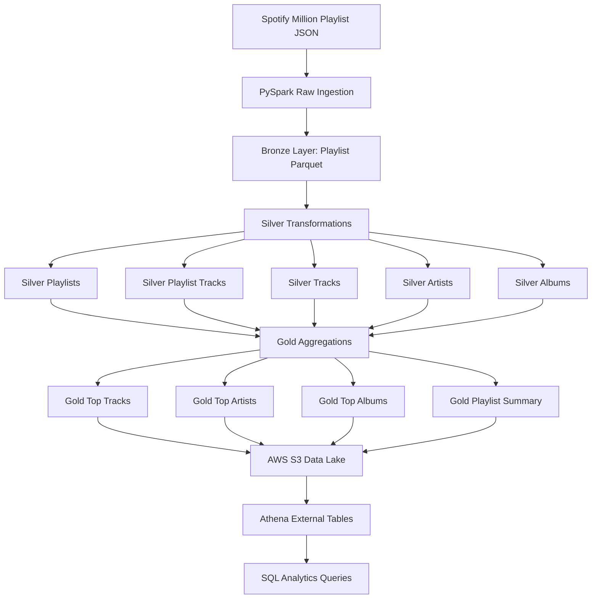

# Spotify Million Playlist Data Engineering Pipeline

## Project Overview

This project implements an end-to-end batch data engineering pipeline for the Spotify Million Playlist Dataset.

The pipeline reads raw nested JSON playlist data, processes it using PySpark, converts it into Parquet-based Bronze, Silver, and Gold layers, uploads the data lake outputs to AWS S3, and enables SQL analytics through AWS Athena.

The project demonstrates data ingestion, nested JSON flattening, data lake modeling, Parquet optimization, cloud storage, Athena external tables, SQL analytics, data validation, logging, and pipeline orchestration.

---

## Business Objective

The goal of this project is to transform raw Spotify playlist data into analytics-ready datasets that can answer music and playlist behavior questions such as:

* Which tracks appear in the most playlists?
* Which artists are most represented across playlists?
* Which albums appear most frequently?
* What are the most common playlist names?
* What are the overall dataset summary metrics?

---

## Tech Stack

| Tool                  | Purpose                                         |
| --------------------- | ----------------------------------------------- |
| Python                | Pipeline scripting                              |
| PySpark               | Large-scale data processing and transformations |
| SQL                   | Analytics queries                               |
| Parquet               | Columnar analytical storage                     |
| AWS S3                | Data lake storage                               |
| AWS Athena            | Serverless SQL querying                         |
| AWS Glue Data Catalog | Metadata catalog for Athena                     |
| Git/GitHub            | Version control and project documentation       |

---

## Architecture Diagram



---

## Data Lake Layers

| Layer  | Purpose                                    | Format  |
| ------ | ------------------------------------------ | ------- |
| Raw    | Original Spotify JSON files                | JSON    |
| Bronze | Source-preserved playlist-level data       | Parquet |
| Silver | Clean normalized analytical tables         | Parquet |
| Gold   | Business-ready aggregated analytics tables | Parquet |

The pipeline follows a Medallion-style architecture where each layer improves data usability and analytical value.

---

## Project Structure

```text
spotify-million-playlist-pipeline/
│
├── data/
│   ├── raw/
│   ├── bronze/
│   ├── silver/
│   └── gold/
│
├── docs/
│   ├── architecture.md
│   ├── bronze_layer_design.md
│   ├── gold_layer_design.md
│   ├── logging_and_error_handling.md
│   ├── main_pipeline_runner.md
│   ├── pipeline_config.md
│   ├── raw_schema_notes.md
│   ├── s3_data_lake_setup.md
│   ├── week1_review.md
│   └── week3_review.md
│
├── logs/
│   └── .gitkeep
│
├── src/
│   ├── __init__.py
│   ├── ingestion/
│   │   ├── __init__.py
│   │   ├── bronze_ingestion.py
│   │   └── read_raw_json.py
│   │
│   ├── quality/
│   │   ├── __init__.py
│   │   ├── inspect_raw_schema.py
│   │   ├── validate_bronze.py
│   │   └── validate_silver.py
│   │
│   ├── transformation/
│   │   ├── __init__.py
│   │   ├── silver_playlists.py
│   │   ├── silver_playlist_tracks.py
│   │   ├── silver_tracks.py
│   │   ├── silver_artists_albums.py
│   │   ├── gold_top_tracks.py
│   │   ├── gold_top_artists_albums.py
│   │   └── gold_playlist_summary.py
│   │
│   └── utils/
│       ├── __init__.py
│       ├── config.py
│       ├── logger.py
│       └── spark_test.py
│
├── sql/
│   ├── athena_ddl/
│   │   ├── create_database.sql
│   │   ├── create_silver_tables.sql
│   │   └── create_gold_tables.sql
│   │
│   └── analytics_queries/
│       ├── top_tracks.sql
│       ├── top_artists.sql
│       ├── top_albums.sql
│       ├── playlist_summary.sql
│       ├── common_playlist_names.sql
│       └── athena_validation_checks.sql
│
├── notebooks/
├── README.md
├── requirements.txt
└── .gitignore
```

---

## Dataset

This project uses the Spotify Million Playlist Dataset.

Each raw JSON file contains a top-level `playlists` array. Each playlist contains playlist-level metadata and a nested `tracks` array.

Example raw structure:

```text
root
 └── playlists
      └── playlist
           ├── pid
           ├── name
           ├── collaborative
           ├── modified_at
           ├── num_tracks
           ├── num_albums
           ├── num_followers
           ├── num_edits
           ├── duration_ms
           └── tracks
                ├── pos
                ├── track_uri
                ├── track_name
                ├── artist_uri
                ├── artist_name
                ├── album_uri
                ├── album_name
                └── duration_ms
```

For local development, this project currently processes one Spotify slice file:

```text
data/raw/mpd.slice.0-999.json
```

This slice contains 1,000 playlists.

---

## Local Setup

Create and activate a Python virtual environment:

```bash
python3 -m venv .venv
source .venv/bin/activate
```

Install dependencies:

```bash
pip install -r requirements.txt
```

Test PySpark:

```bash
python -m src.utils.spark_test
```

Expected result:

```text
Spark session created successfully.
Spark version: ...
Sample DataFrame:
...
```

---

## Configuration

Project paths are centralized in:

```text
src/utils/config.py
```

This file stores local paths and S3 paths for Raw, Bronze, Silver, and Gold layers.

This avoids hardcoding paths repeatedly across the project.

Example paths:

```python
RAW_DATA_PATH = "data/raw/mpd.slice.0-999.json"
BRONZE_PLAYLISTS_PATH = "data/bronze/playlists/"

S3_BUCKET = "spotify-million-playlist-data-lake-arvind-2026"
S3_BASE_PATH = "s3://spotify-million-playlist-data-lake-arvind-2026/spotify"
```

---

## How to Run the Pipeline

Run the full local pipeline:

```bash
python -m src.main
```

Pipeline order:

```text
1. Bronze ingestion
2. Silver playlists transformation
3. Silver playlist_tracks transformation
4. Silver tracks transformation
5. Silver artists and albums transformation
6. Gold top_tracks aggregation
7. Gold top_artists and top_albums aggregation
8. Gold playlist_summary aggregation
```

Each step writes Parquet outputs to the local `data/` folder.

---

## Bronze Layer

Bronze script:

```text
src/ingestion/bronze_ingestion.py
```

Input:

```text
data/raw/mpd.slice.0-999.json
```

Output:

```text
data/bronze/playlists/
```

Bronze grain:

```text
One row per playlist
```

Bronze columns:

```text
playlist_id
playlist_name
collaborative
modified_at
num_tracks
num_albums
num_followers
num_edits
playlist_duration_ms
tracks
ingestion_timestamp
source_file
```

The Bronze layer keeps the nested `tracks` array and adds ingestion metadata.

---

## Silver Layer

The Silver layer normalizes the nested Bronze data into clean analytical tables.

Silver outputs:

```text
data/silver/playlists/
data/silver/playlist_tracks/
data/silver/tracks/
data/silver/artists/
data/silver/albums/
```

Silver table design:

| Table             | Grain                                         | Purpose                                   |
| ----------------- | --------------------------------------------- | ----------------------------------------- |
| `playlists`       | One row per playlist                          | Stores playlist metadata                  |
| `playlist_tracks` | One row per track placement inside a playlist | Bridge table between playlists and tracks |
| `tracks`          | One row per unique track                      | Stores track metadata                     |
| `artists`         | One row per unique artist                     | Stores artist metadata                    |
| `albums`          | One row per unique album                      | Stores album metadata                     |

The `playlist_tracks` table is the central bridge table because it represents the many-to-many relationship between playlists and tracks.

---

## Silver Data Model

```text
silver_playlists
    playlist_id
    playlist_name
    num_tracks
    num_followers

silver_playlist_tracks
    playlist_id
    track_id
    position

silver_tracks
    track_id
    track_name
    artist_id
    artist_name
    album_id
    album_name
    track_duration_ms

silver_artists
    artist_id
    artist_name

silver_albums
    album_id
    album_name
    artist_id
    artist_name
```

Relationship:

```text
silver_playlists
        ↓
silver_playlist_tracks
        ↓
silver_tracks
        ↓
silver_artists / silver_albums
```

---

## Gold Layer

The Gold layer contains business-ready analytics tables created from the Silver tables.

Gold outputs:

```text
data/gold/top_tracks/
data/gold/top_artists/
data/gold/top_albums/
data/gold/playlist_summary/
```

Gold table design:

| Table              | Business Question                                     |
| ------------------ | ----------------------------------------------------- |
| `top_tracks`       | Which tracks appear in the most playlists?            |
| `top_artists`      | Which artists are most represented across playlists?  |
| `top_albums`       | Which albums appear most frequently across playlists? |
| `playlist_summary` | What are the overall dataset summary metrics?         |

---

## Gold Top Tracks

Script:

```text
src/transformation/gold_top_tracks.py
```

Inputs:

```text
data/silver/playlist_tracks/
data/silver/tracks/
```

Output:

```text
data/gold/top_tracks/
```

Columns:

```text
track_id
track_name
artist_id
artist_name
album_id
album_name
playlist_count
total_appearances
```

This table ranks tracks by playlist appearances.

---

## Gold Top Artists and Albums

Script:

```text
src/transformation/gold_top_artists_albums.py
```

Inputs:

```text
data/silver/playlist_tracks/
data/silver/tracks/
```

Outputs:

```text
data/gold/top_artists/
data/gold/top_albums/
```

Metrics:

```text
playlist_count
track_appearance_count
unique_track_count
```

These tables identify the most represented artists and albums across playlists.

---

## Gold Playlist Summary

Script:

```text
src/transformation/gold_playlist_summary.py
```

Inputs:

```text
data/silver/playlists/
data/silver/playlist_tracks/
data/silver/tracks/
data/silver/artists/
data/silver/albums/
```

Output:

```text
data/gold/playlist_summary/
```

Metrics:

```text
summary_level
total_playlists
total_playlist_track_rows
unique_tracks
unique_artists
unique_albums
average_tracks_per_playlist
average_followers_per_playlist
max_tracks_in_playlist
min_tracks_in_playlist
```

---

## Data Quality Checks

Validation scripts:

```text
src/quality/validate_bronze.py
src/quality/validate_silver.py
```

Bronze checks include:

* Required column validation
* Row count check
* Null playlist ID check
* Duplicate playlist ID check
* Tracks array null/empty check
* `num_tracks` versus actual tracks array size check

Silver checks include:

* Non-empty table checks
* Null ID checks
* Duplicate ID checks
* Playlist-to-playlist_tracks relationship validation
* Track-to-playlist_tracks relationship validation
* Silver layer summary counts

Run Bronze validation:

```bash
python -m src.quality.validate_bronze
```

Run Silver validation:

```bash
python -m src.quality.validate_silver
```

---

## Logging and Error Handling

Logger utility:

```text
src/utils/logger.py
```

Main runner:

```text
src/main.py
```

Logs are written to:

```text
logs/pipeline_YYYYMMDD.log
```

The main pipeline runner logs each pipeline step and stops execution if any step fails.

Run command:

```bash
python -m src.main
```

---

## AWS S3 Data Lake

S3 bucket:

```text
s3://spotify-million-playlist-data-lake-arvind-2026/
```

S3 structure:

```text
spotify/
├── raw/
├── bronze/
├── silver/
└── gold/
```

Upload commands:

```bash
aws s3 sync data/raw/ s3://spotify-million-playlist-data-lake-arvind-2026/spotify/raw/
aws s3 sync data/bronze/ s3://spotify-million-playlist-data-lake-arvind-2026/spotify/bronze/
aws s3 sync data/silver/ s3://spotify-million-playlist-data-lake-arvind-2026/spotify/silver/
aws s3 sync data/gold/ s3://spotify-million-playlist-data-lake-arvind-2026/spotify/gold/
```

Verify S3 upload:

```bash
aws s3 ls s3://spotify-million-playlist-data-lake-arvind-2026/spotify/
aws s3 ls s3://spotify-million-playlist-data-lake-arvind-2026/spotify/raw/
aws s3 ls s3://spotify-million-playlist-data-lake-arvind-2026/spotify/bronze/
aws s3 ls s3://spotify-million-playlist-data-lake-arvind-2026/spotify/silver/
aws s3 ls s3://spotify-million-playlist-data-lake-arvind-2026/spotify/gold/
```

---

## AWS Athena External Tables

Athena database:

```text
spotify_analytics
```

DDL files:

```text
sql/athena_ddl/create_database.sql
sql/athena_ddl/create_silver_tables.sql
sql/athena_ddl/create_gold_tables.sql
```

Athena tables:

```text
silver_playlists
silver_playlist_tracks
silver_tracks
silver_artists
silver_albums
gold_top_tracks
gold_top_artists
gold_top_albums
gold_playlist_summary
```

Example Athena query:

```sql
SELECT
    track_name,
    artist_name,
    playlist_count
FROM gold_top_tracks
ORDER BY playlist_count DESC
LIMIT 10;
```

---

## Athena Analytics Queries

Reusable Athena SQL queries are stored in:

```text
sql/analytics_queries/
```

Query files:

```text
top_tracks.sql
top_artists.sql
top_albums.sql
playlist_summary.sql
common_playlist_names.sql
athena_validation_checks.sql
```

These queries answer:

* Which tracks appear in the most playlists?
* Which artists are most represented across playlists?
* Which albums appear most frequently?
* What are the most common playlist names?
* What are the overall dataset summary metrics?

---

## Example SQL Queries

Top tracks:

```sql
SELECT
    track_name,
    artist_name,
    album_name,
    playlist_count,
    total_appearances
FROM gold_top_tracks
ORDER BY playlist_count DESC, total_appearances DESC
LIMIT 20;
```

Top artists:

```sql
SELECT
    artist_name,
    playlist_count,
    track_appearance_count,
    unique_track_count
FROM gold_top_artists
ORDER BY playlist_count DESC, track_appearance_count DESC
LIMIT 20;
```

Playlist summary:

```sql
SELECT
    summary_level,
    total_playlists,
    total_playlist_track_rows,
    unique_tracks,
    unique_artists,
    unique_albums,
    average_tracks_per_playlist,
    average_followers_per_playlist,
    max_tracks_in_playlist,
    min_tracks_in_playlist
FROM gold_playlist_summary;
```

Common playlist names:

```sql
SELECT
    LOWER(TRIM(playlist_name)) AS playlist_name,
    COUNT(*) AS playlist_name_count,
    ROUND(AVG(num_tracks), 2) AS average_num_tracks,
    ROUND(AVG(num_followers), 2) AS average_num_followers
FROM silver_playlists
WHERE playlist_name IS NOT NULL
GROUP BY LOWER(TRIM(playlist_name))
ORDER BY playlist_name_count DESC, average_num_tracks DESC
LIMIT 20;
```

---

## Results

Using one Spotify playlist slice file, the pipeline processed:

```text
1,000 playlists
```

The pipeline created:

```text
Bronze playlist Parquet data
Silver normalized playlist, track, artist, album, and bridge tables
Gold analytics tables for tracks, artists, albums, and dataset summary
Athena external tables for SQL querying
```

Add actual Athena query results here after running the analytics queries:

```text
Total playlists:
Total playlist-track rows:
Unique tracks:
Unique artists:
Unique albums:
Top track:
Top artist:
Top album:
```

---

## Key Engineering Decisions

### 1. Parquet Instead of JSON for Processed Layers

Raw JSON is useful for ingestion, but Parquet is better for analytical workloads because it is columnar, compressed, and efficient for Spark and Athena.

### 2. Bronze Keeps Nested Tracks

The Bronze layer keeps the nested `tracks` array to preserve the source structure while still converting the data to Parquet.

### 3. Silver Normalizes the Data

The Silver layer separates playlists, playlist-track relationships, tracks, artists, and albums into clean analytical tables.

### 4. Playlist Tracks as Bridge Table

The `playlist_tracks` table is the core bridge table because playlists and tracks have a many-to-many relationship.

### 5. Gold Pre-Aggregates Business Metrics

The Gold layer stores ready-to-query analytics tables so users do not need to repeatedly write complex joins and aggregations.

---

## Future Improvements

Potential improvements:

* Process all Spotify Million Playlist Dataset slices
* Add partitioning for larger-scale processing
* Add an automated S3 upload script
* Add a Gold common playlist names table
* Add Airflow orchestration
* Add AWS Glue crawler integration
* Add Great Expectations for data quality testing
* Add dashboarding with Amazon QuickSight or Power BI
* Add incremental processing support
* Add CI/CD checks for code quality and SQL validation

---

## Resume Summary

Built an end-to-end PySpark data engineering pipeline for the Spotify Million Playlist Dataset, transforming nested JSON playlist data into Bronze, Silver, and Gold Parquet layers, storing outputs in AWS S3, and enabling SQL analytics through Athena external tables.

---

## Repository Status

Current completed stages:

```text
Project setup
Raw JSON ingestion
Bronze Parquet layer
Silver normalized tables
Gold analytics tables
Bronze and Silver validation
Main pipeline runner
Logging and error handling
S3 data lake upload
Athena external tables
Reusable SQL analytics queries
```
