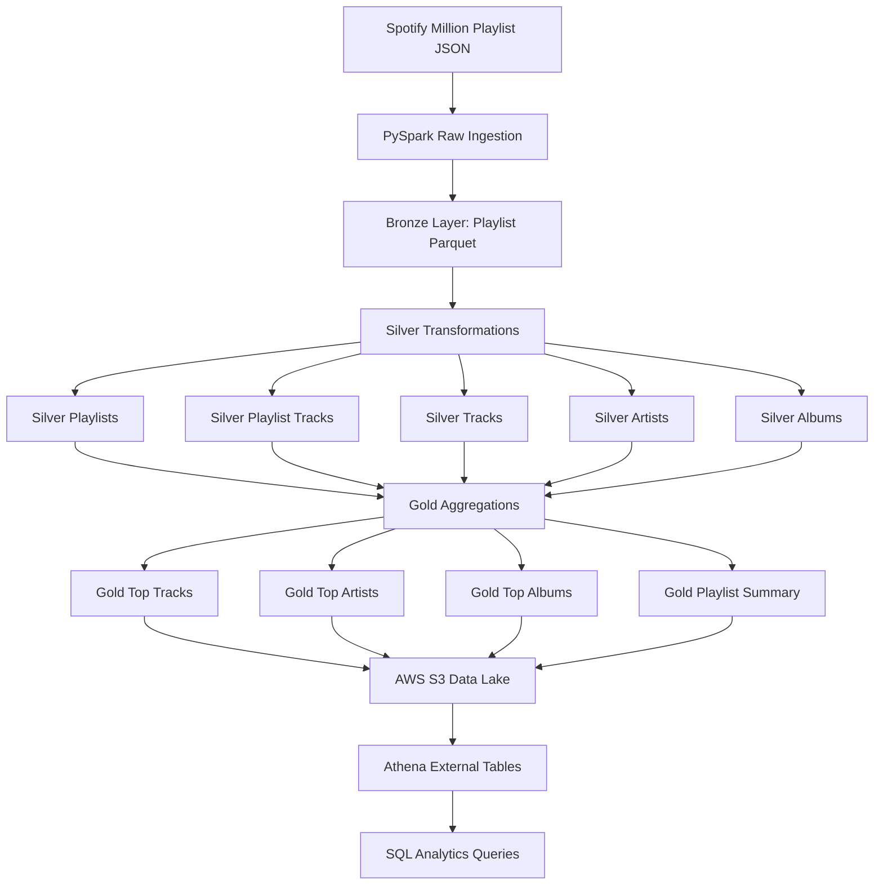

# Architecture — Spotify Million Playlist Data Engineering Pipeline

## Overview

This project implements an end-to-end batch data engineering pipeline for the Spotify Million Playlist Dataset.

The pipeline reads raw nested Spotify playlist JSON files, processes them using PySpark, converts the data into Parquet-based Bronze, Silver, and Gold layers, uploads the outputs to AWS S3, and enables SQL analytics through AWS Athena.

The architecture is designed to demonstrate practical data engineering skills, including:

* Raw data ingestion
* Nested JSON processing
* PySpark transformations
* Bronze, Silver, and Gold data lake modeling
* Parquet-based storage optimization
* AWS S3 data lake organization
* Athena external tables
* SQL analytics
* Data validation
* Logging and pipeline orchestration

---

## High-Level Architecture

```text
Spotify Million Playlist JSON
            ↓
      PySpark Ingestion
            ↓
      Bronze Parquet Layer
            ↓
   PySpark Silver Transformations
            ↓
   Silver Normalized Tables
            ↓
    PySpark Gold Aggregations
            ↓
    Gold Analytics Tables
            ↓
        AWS S3 Data Lake
            ↓
      Athena External Tables
            ↓
        SQL Analytics
```

---

## Mermaid Architecture Diagram



---

## Architecture Components

| Component                     | Purpose                                                                          |
| ----------------------------- | -------------------------------------------------------------------------------- |
| Spotify Million Playlist JSON | Source dataset containing playlist metadata and nested track arrays              |
| PySpark                       | Main processing engine for ingestion, flattening, normalization, and aggregation |
| Parquet                       | Columnar storage format used for Bronze, Silver, and Gold layers                 |
| AWS S3                        | Cloud data lake storage                                                          |
| AWS Athena                    | Serverless SQL query engine                                                      |
| AWS Glue Data Catalog         | Metadata catalog used by Athena external tables                                  |
| SQL                           | Analytics query layer                                                            |
| Python                        | Pipeline scripting, validation, logging, and orchestration                       |

---

## Data Flow Summary

```text
Raw JSON
   ↓
Bronze Parquet
   ↓
Silver Normalized Tables
   ↓
Gold Analytics Tables
   ↓
S3 Data Lake
   ↓
Athena SQL Analytics
```

Each layer has a specific responsibility:

| Layer  | Responsibility                                            |
| ------ | --------------------------------------------------------- |
| Raw    | Store original source JSON files                          |
| Bronze | Convert raw JSON into source-preserved Parquet            |
| Silver | Clean, flatten, and normalize data into analytical tables |
| Gold   | Create business-ready aggregated datasets                 |
| S3     | Store data lake outputs in the cloud                      |
| Athena | Query Silver and Gold Parquet data using SQL              |

---

## Raw Layer

## Purpose

The Raw layer stores the original Spotify Million Playlist JSON files without transformation.

This layer acts as the source of truth for the pipeline.

## Local Path

```text
data/raw/
```

Example file:

```text
data/raw/mpd.slice.0-999.json
```

## S3 Path

```text
s3://spotify-million-playlist-data-lake-arvind-2026/spotify/raw/
```

## Raw Data Structure

Each JSON file contains a top-level `playlists` array.

```text
root
 └── playlists
      └── playlist
           ├── pid
           ├── name
           ├── collaborative
           ├── modified_at
           ├── num_tracks
           ├── num_albums
           ├── num_followers
           ├── num_edits
           ├── duration_ms
           └── tracks
                ├── pos
                ├── track_uri
                ├── track_name
                ├── artist_uri
                ├── artist_name
                ├── album_uri
                ├── album_name
                └── duration_ms
```

## Raw Layer Design Decision

The Raw layer is not modified. It stores the original JSON files so the pipeline can be reprocessed from the original source if needed.

---

## Bronze Layer

## Purpose

The Bronze layer converts raw Spotify JSON into Parquet format while preserving the original playlist structure.

The Bronze layer is lightly processed. It does not fully clean, deduplicate, flatten, or aggregate the data.

## Local Path

```text
data/bronze/playlists/
```

## S3 Path

```text
s3://spotify-million-playlist-data-lake-arvind-2026/spotify/bronze/playlists/
```

## Input

```text
data/raw/mpd.slice.0-999.json
```

## Output

```text
data/bronze/playlists/
```

## Processing Script

```text
src/ingestion/bronze_ingestion.py
```

## Bronze Grain

```text
One row per playlist
```

## Bronze Columns

```text
playlist_id
playlist_name
collaborative
modified_at
num_tracks
num_albums
num_followers
num_edits
playlist_duration_ms
tracks
ingestion_timestamp
source_file
```

## Bronze Transformation Logic

The Bronze ingestion job:

1. Reads raw Spotify JSON.
2. Explodes the top-level `playlists` array.
3. Selects playlist-level fields.
4. Renames raw fields into cleaner column names.
5. Keeps the nested `tracks` array unchanged.
6. Adds `ingestion_timestamp`.
7. Adds `source_file`.
8. Writes the output as Parquet.

## Bronze Design Decision

The nested `tracks` array is intentionally preserved in Bronze.

This keeps Bronze close to the original source structure while still improving storage and read performance through Parquet.

---

## Silver Layer

## Purpose

The Silver layer converts the nested Bronze data into clean, normalized analytical tables.

This is where the nested `tracks` array is flattened and separated into relational-style tables.

## Local Paths

```text
data/silver/playlists/
data/silver/playlist_tracks/
data/silver/tracks/
data/silver/artists/
data/silver/albums/
```

## S3 Paths

```text
s3://spotify-million-playlist-data-lake-arvind-2026/spotify/silver/playlists/
s3://spotify-million-playlist-data-lake-arvind-2026/spotify/silver/playlist_tracks/
s3://spotify-million-playlist-data-lake-arvind-2026/spotify/silver/tracks/
s3://spotify-million-playlist-data-lake-arvind-2026/spotify/silver/artists/
s3://spotify-million-playlist-data-lake-arvind-2026/spotify/silver/albums/
```

---

## Silver Tables

| Table                    | Path                           | Grain                                         | Purpose                                   |
| ------------------------ | ------------------------------ | --------------------------------------------- | ----------------------------------------- |
| `silver_playlists`       | `data/silver/playlists/`       | One row per playlist                          | Stores playlist metadata                  |
| `silver_playlist_tracks` | `data/silver/playlist_tracks/` | One row per track placement inside a playlist | Bridge table between playlists and tracks |
| `silver_tracks`          | `data/silver/tracks/`          | One row per unique track                      | Stores track metadata                     |
| `silver_artists`         | `data/silver/artists/`         | One row per unique artist                     | Stores artist metadata                    |
| `silver_albums`          | `data/silver/albums/`          | One row per unique album                      | Stores album metadata                     |

---

## Silver Playlists Table

## Script

```text
src/transformation/silver_playlists.py
```

## Input

```text
data/bronze/playlists/
```

## Output

```text
data/silver/playlists/
```

## Grain

```text
One row per playlist
```

## Columns

```text
playlist_id
playlist_name
collaborative
modified_at
num_tracks
num_albums
num_followers
num_edits
playlist_duration_ms
ingestion_timestamp
source_file
```

## Purpose

This table stores clean playlist-level metadata and removes the nested `tracks` array.

---

## Silver Playlist Tracks Table

## Script

```text
src/transformation/silver_playlist_tracks.py
```

## Input

```text
data/bronze/playlists/
```

## Output

```text
data/silver/playlist_tracks/
```

## Grain

```text
One row per track inside a playlist
```

## Columns

```text
playlist_id
track_id
position
ingestion_timestamp
source_file
```

## Purpose

This is the central bridge table in the Silver layer.

It represents the many-to-many relationship between playlists and tracks:

```text
One playlist contains many tracks.
One track can appear in many playlists.
```

---

## Silver Tracks Table

## Script

```text
src/transformation/silver_tracks.py
```

## Input

```text
data/bronze/playlists/
```

## Output

```text
data/silver/tracks/
```

## Grain

```text
One row per unique track
```

## Columns

```text
track_id
track_name
artist_id
artist_name
album_id
album_name
track_duration_ms
ingestion_timestamp
source_file
```

## Purpose

This table stores deduplicated track metadata using `track_id`.

---

## Silver Artists Table

## Script

```text
src/transformation/silver_artists_albums.py
```

## Input

```text
data/bronze/playlists/
```

## Output

```text
data/silver/artists/
```

## Grain

```text
One row per unique artist
```

## Columns

```text
artist_id
artist_name
ingestion_timestamp
source_file
```

## Purpose

This table stores deduplicated artist metadata using `artist_id`.

---

## Silver Albums Table

## Script

```text
src/transformation/silver_artists_albums.py
```

## Input

```text
data/bronze/playlists/
```

## Output

```text
data/silver/albums/
```

## Grain

```text
One row per unique album
```

## Columns

```text
album_id
album_name
artist_id
artist_name
ingestion_timestamp
source_file
```

## Purpose

This table stores deduplicated album metadata using `album_id`.

---

## Silver Data Model

```text
silver_playlists
    playlist_id
    playlist_name
    num_tracks
    num_followers

silver_playlist_tracks
    playlist_id
    track_id
    position

silver_tracks
    track_id
    track_name
    artist_id
    artist_name
    album_id
    album_name
    track_duration_ms

silver_artists
    artist_id
    artist_name

silver_albums
    album_id
    album_name
    artist_id
    artist_name
```

## Silver Table Relationships

```text
silver_playlists.playlist_id
        ↓
silver_playlist_tracks.playlist_id

silver_playlist_tracks.track_id
        ↓
silver_tracks.track_id

silver_tracks.artist_id
        ↓
silver_artists.artist_id

silver_tracks.album_id
        ↓
silver_albums.album_id
```

## Silver Design Decision

The Silver layer normalizes the nested JSON into separate playlist, track, artist, album, and bridge tables.

This makes the data easier to query with SQL and prepares it for Gold-level aggregations.

---

## Gold Layer

## Purpose

The Gold layer contains business-ready analytics tables created from the normalized Silver tables.

Gold tables are pre-aggregated to answer common analytics questions without requiring users to repeatedly write complex joins.

## Local Paths

```text
data/gold/top_tracks/
data/gold/top_artists/
data/gold/top_albums/
data/gold/playlist_summary/
```

## S3 Paths

```text
s3://spotify-million-playlist-data-lake-arvind-2026/spotify/gold/top_tracks/
s3://spotify-million-playlist-data-lake-arvind-2026/spotify/gold/top_artists/
s3://spotify-million-playlist-data-lake-arvind-2026/spotify/gold/top_albums/
s3://spotify-million-playlist-data-lake-arvind-2026/spotify/gold/playlist_summary/
```

---

## Gold Tables

| Table                   | Path                          | Grain                           | Business Question                                     |
| ----------------------- | ----------------------------- | ------------------------------- | ----------------------------------------------------- |
| `gold_top_tracks`       | `data/gold/top_tracks/`       | One row per track               | Which tracks appear in the most playlists?            |
| `gold_top_artists`      | `data/gold/top_artists/`      | One row per artist              | Which artists are most represented across playlists?  |
| `gold_top_albums`       | `data/gold/top_albums/`       | One row per album               | Which albums appear most frequently across playlists? |
| `gold_playlist_summary` | `data/gold/playlist_summary/` | One row for the dataset summary | What are the overall dataset summary metrics?         |

---

## Gold Top Tracks Table

## Script

```text
src/transformation/gold_top_tracks.py
```

## Inputs

```text
data/silver/playlist_tracks/
data/silver/tracks/
```

## Output

```text
data/gold/top_tracks/
```

## Grain

```text
One row per track
```

## Columns

```text
track_id
track_name
artist_id
artist_name
album_id
album_name
playlist_count
total_appearances
```

## Metrics

| Metric              | Meaning                                           |
| ------------------- | ------------------------------------------------- |
| `playlist_count`    | Number of distinct playlists containing the track |
| `total_appearances` | Total number of track placements across playlists |

---

## Gold Top Artists Table

## Script

```text
src/transformation/gold_top_artists_albums.py
```

## Inputs

```text
data/silver/playlist_tracks/
data/silver/tracks/
```

## Output

```text
data/gold/top_artists/
```

## Grain

```text
One row per artist
```

## Columns

```text
artist_id
artist_name
playlist_count
track_appearance_count
unique_track_count
```

## Metrics

| Metric                   | Meaning                                                                  |
| ------------------------ | ------------------------------------------------------------------------ |
| `playlist_count`         | Number of distinct playlists containing at least one track by the artist |
| `track_appearance_count` | Total number of track placements by the artist                           |
| `unique_track_count`     | Number of unique tracks by the artist                                    |

---

## Gold Top Albums Table

## Script

```text
src/transformation/gold_top_artists_albums.py
```

## Inputs

```text
data/silver/playlist_tracks/
data/silver/tracks/
```

## Output

```text
data/gold/top_albums/
```

## Grain

```text
One row per album
```

## Columns

```text
album_id
album_name
artist_id
artist_name
playlist_count
track_appearance_count
unique_track_count
```

## Metrics

| Metric                   | Meaning                                                                   |
| ------------------------ | ------------------------------------------------------------------------- |
| `playlist_count`         | Number of distinct playlists containing at least one track from the album |
| `track_appearance_count` | Total number of track placements from the album                           |
| `unique_track_count`     | Number of unique tracks from the album                                    |

---

## Gold Playlist Summary Table

## Script

```text
src/transformation/gold_playlist_summary.py
```

## Inputs

```text
data/silver/playlists/
data/silver/playlist_tracks/
data/silver/tracks/
data/silver/artists/
data/silver/albums/
```

## Output

```text
data/gold/playlist_summary/
```

## Grain

```text
One row for the full dataset summary
```

## Columns

```text
summary_level
total_playlists
total_playlist_track_rows
unique_tracks
unique_artists
unique_albums
average_tracks_per_playlist
average_followers_per_playlist
max_tracks_in_playlist
min_tracks_in_playlist
```

## Purpose

This table stores high-level dataset summary metrics.

---

## Processing Jobs

| Stage                       | Script                                          |
| --------------------------- | ----------------------------------------------- |
| Spark test                  | `src/utils/spark_test.py`                       |
| Raw schema inspection       | `src/quality/inspect_raw_schema.py`             |
| Bronze ingestion            | `src/ingestion/bronze_ingestion.py`             |
| Bronze validation           | `src/quality/validate_bronze.py`                |
| Silver playlists            | `src/transformation/silver_playlists.py`        |
| Silver playlist tracks      | `src/transformation/silver_playlist_tracks.py`  |
| Silver tracks               | `src/transformation/silver_tracks.py`           |
| Silver artists and albums   | `src/transformation/silver_artists_albums.py`   |
| Silver validation           | `src/quality/validate_silver.py`                |
| Gold top tracks             | `src/transformation/gold_top_tracks.py`         |
| Gold top artists and albums | `src/transformation/gold_top_artists_albums.py` |
| Gold playlist summary       | `src/transformation/gold_playlist_summary.py`   |
| Full pipeline runner        | `src/main.py`                                   |

---

## Main Pipeline Runner

The full local pipeline can be run using:

```bash
python -m src.main
```

Pipeline order:

```text
1. Bronze ingestion
2. Silver playlists transformation
3. Silver playlist_tracks transformation
4. Silver tracks transformation
5. Silver artists and albums transformation
6. Gold top_tracks aggregation
7. Gold top_artists and top_albums aggregation
8. Gold playlist_summary aggregation
```

The pipeline runner logs each step and stops execution if a step fails.

---

## Configuration

Pipeline paths are centralized in:

```text
src/utils/config.py
```

This file stores local and S3 paths for Raw, Bronze, Silver, and Gold layers.

Example:

```python
RAW_DATA_PATH = "data/raw/mpd.slice.0-999.json"
BRONZE_PLAYLISTS_PATH = "data/bronze/playlists/"

S3_BUCKET = "spotify-million-playlist-data-lake-arvind-2026"
S3_BASE_PATH = "s3://spotify-million-playlist-data-lake-arvind-2026/spotify"
```

---

## Logging and Error Handling

Logger utility:

```text
src/utils/logger.py
```

Log output:

```text
logs/pipeline_YYYYMMDD.log
```

The main pipeline runner logs:

* Pipeline start
* Each step start
* Each step completion
* Step failures
* Pipeline completion

If a step fails, the pipeline stops and logs the exception.

---

## Data Quality Architecture

The project includes validation scripts for Bronze and Silver layers.

## Bronze Validation

Script:

```text
src/quality/validate_bronze.py
```

Checks:

* Required columns exist
* Bronze table is not empty
* No null playlist IDs
* No duplicate playlist IDs
* Tracks array is not null or empty
* `num_tracks` matches the actual size of the `tracks` array

## Silver Validation

Script:

```text
src/quality/validate_silver.py
```

Checks:

* Silver tables are readable
* Silver tables are non-empty
* Primary IDs are not null
* Dimension table IDs are not duplicated
* `playlist_tracks.playlist_id` values exist in `playlists`
* `playlist_tracks.track_id` values exist in `tracks`

---

## AWS S3 Data Lake Architecture

## S3 Bucket

```text
s3://spotify-million-playlist-data-lake-arvind-2026/
```

## S3 Data Lake Structure

```text
s3://spotify-million-playlist-data-lake-arvind-2026/
└── spotify/
    ├── raw/
    ├── bronze/
    │   └── playlists/
    ├── silver/
    │   ├── playlists/
    │   ├── playlist_tracks/
    │   ├── tracks/
    │   ├── artists/
    │   └── albums/
    └── gold/
        ├── top_tracks/
        ├── top_artists/
        ├── top_albums/
        └── playlist_summary/
```

## Layer Purpose in S3

| S3 Layer          | Purpose                                 |
| ----------------- | --------------------------------------- |
| `spotify/raw/`    | Original Spotify JSON files             |
| `spotify/bronze/` | Source-preserved Parquet playlist data  |
| `spotify/silver/` | Normalized Parquet analytical tables    |
| `spotify/gold/`   | Business-ready Parquet analytics tables |

---

## Athena Architecture

AWS Athena is used to query Silver and Gold Parquet datasets stored in S3.

Athena external tables point directly to the S3 locations.

## Athena Database

```text
spotify_analytics
```

## Athena DDL Files

```text
sql/athena_ddl/create_database.sql
sql/athena_ddl/create_silver_tables.sql
sql/athena_ddl/create_gold_tables.sql
```

## Athena Tables

```text
silver_playlists
silver_playlist_tracks
silver_tracks
silver_artists
silver_albums
gold_top_tracks
gold_top_artists
gold_top_albums
gold_playlist_summary
```

## Athena Query Flow

```text
Athena SQL Query
        ↓
Glue Data Catalog Table Metadata
        ↓
S3 Parquet Location
        ↓
Query Results
```

---

## SQL Analytics Layer

Reusable SQL analytics queries are stored in:

```text
sql/analytics_queries/
```

Query files:

```text
top_tracks.sql
top_artists.sql
top_albums.sql
playlist_summary.sql
common_playlist_names.sql
athena_validation_checks.sql
```

## Example Query: Top Tracks

```sql
SELECT
    track_name,
    artist_name,
    playlist_count
FROM gold_top_tracks
ORDER BY playlist_count DESC
LIMIT 10;
```

## Example Query: Playlist Summary

```sql
SELECT
    summary_level,
    total_playlists,
    total_playlist_track_rows,
    unique_tracks,
    unique_artists,
    unique_albums,
    average_tracks_per_playlist,
    average_followers_per_playlist,
    max_tracks_in_playlist,
    min_tracks_in_playlist
FROM gold_playlist_summary;
```

## Example Query: Common Playlist Names

```sql
SELECT
    LOWER(TRIM(playlist_name)) AS playlist_name,
    COUNT(*) AS playlist_name_count,
    ROUND(AVG(num_tracks), 2) AS average_num_tracks,
    ROUND(AVG(num_followers), 2) AS average_num_followers
FROM silver_playlists
WHERE playlist_name IS NOT NULL
GROUP BY LOWER(TRIM(playlist_name))
ORDER BY playlist_name_count DESC, average_num_tracks DESC
LIMIT 20;
```

---

## End-to-End Architecture Flow

```text
1. Raw JSON file is placed in data/raw/
2. Bronze ingestion reads JSON and writes playlist-level Parquet
3. Silver transformations flatten and normalize nested playlist-track data
4. Gold aggregations create business-ready analytics tables
5. Local Raw, Bronze, Silver, and Gold folders are uploaded to S3
6. Athena external tables are created on top of S3 Parquet folders
7. SQL analytics queries are run in Athena
```

---

## Current Processing Scope

The project currently processes one Spotify slice file:

```text
data/raw/mpd.slice.0-999.json
```

This represents:

```text
1,000 playlists
```

The architecture can be extended to process more slice files by updating the raw input path and running the same pipeline over multiple JSON files.

---

## Key Engineering Decisions

## 1. Parquet for Processed Layers

The Raw layer keeps the original JSON source files, but Bronze, Silver, and Gold use Parquet.

Parquet is used because it is:

* Columnar
* Compressed
* Efficient for Spark reads and writes
* Efficient for Athena queries
* Better suited for analytical workloads

## 2. Bronze Preserves Source Structure

The Bronze layer keeps one row per playlist and preserves the nested `tracks` array.

This keeps the Bronze layer close to the original source while still improving storage format.

## 3. Silver Normalizes Data

The Silver layer separates playlists, playlist-track relationships, tracks, artists, and albums.

This supports cleaner SQL queries and avoids repeatedly processing nested JSON.

## 4. Playlist Tracks as the Bridge Table

The `silver_playlist_tracks` table is the central bridge table.

It connects playlists to tracks and enables playlist-level, track-level, artist-level, and album-level analytics.

## 5. Gold Pre-Aggregates Analytics

The Gold layer creates ready-to-query analytics tables.

This makes Athena queries simpler and avoids repeatedly writing joins and aggregations.

## 6. Athena Queries S3 Directly

Athena external tables allow SQL querying directly over Parquet files stored in S3.

This avoids loading data into a traditional database.

---

## Future Architecture Improvements

Potential future improvements include:

* Process all Spotify Million Playlist Dataset slices
* Add partitioning by ingestion date or source file
* Add automated S3 upload script
* Add Gold `common_playlist_names` table
* Add AWS Glue crawler integration
* Add Airflow orchestration
* Add Great Expectations data quality checks
* Add dashboarding through Amazon QuickSight or Power BI
* Add incremental processing
* Add CI/CD validation for Python and SQL files
* Add environment-based configs for local and cloud runs

---

## Architecture Summary

This architecture demonstrates an end-to-end data engineering workflow:

```text
Nested JSON ingestion
        ↓
PySpark transformation
        ↓
Parquet data lake layers
        ↓
S3 cloud storage
        ↓
Athena external tables
        ↓
SQL analytics
```

The project shows how raw semi-structured data can be converted into clean, normalized, and analytics-ready datasets using a modern data lake architecture.
